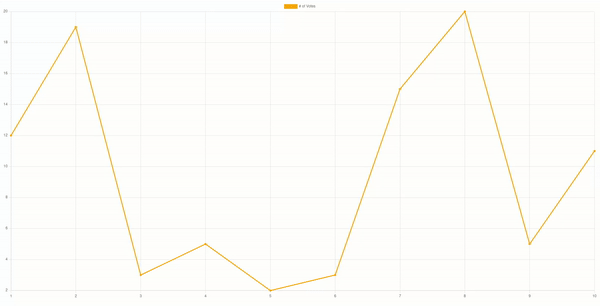

<p align="center">
  Just a simple wrapper React component for <a href="https://www.chartjs.org/">Chart.js</a> 3.
</p>

<p align="center">
  <a href="https://www.npmjs.com/package/react-chartjs3-wrapper"></a>
  <a href="https://github.com/roxennnn/react-chartjs3-wrapper/blob/master/LICENSE"></a>
</p>

## Installation
```npm
npm i react-chartjs3-wrapper
```

## Usage
The following shows how to create a React Chart.js 3 component.
```tsx
import React from 'react';
import { ChartJsComponent, conditionalRegistration } from 'react-chartjs3-wrapper';

const MyComponent = () => {
  useEffect(() => {
    conditionalRegistration({
      line: true,
      title: true,
      legend: true
    })
  }, [])
  return (
    <div>
      <ChartJsComponent
        type="line"
        data={data}
        options={options}
      />
    </div>
  );
};
```

## Documentation
### Component
The `ChartJsComponent` is a simple component which wraps a Chart.js chart. The available props are:
* `type`: the type of the chart (`line`, `bar`, `pie`, ...)
* `data`: the data to be displayed in the chart (it must be a Chart.js `ChartData` object)
* `options`: the chart options: (it must be a Chart.js `ChartOptions` object)
* `plugins`: the plugins used by the chart (it must be a Chart.js `Plugin` object array)

### Vertical Crosshair
Moreover, there are 2 more props which can be used to enable a plugin included in the library: the **Vertical Crosshair** plugin. These props are:
* `enableVerticalCrosshair`: to enable the plugin
* `crosshairOptions`: options used to customize the crosshair:
  * `color`: the color of the vertical crosshair (default is `#000000`)
  * `lineWidth`: the width of the vertical crosshair (default is `2`)


### Registration
Being Chart.js 3 *tree-shakeable*, controllers, elements, scales and plugins to use are needed to be imported and registered. There are some functions to simplify these procedures:
* `registerAll`: to quickly register all the available items, however not making use of the *tree-shakeable* feature
* `conditionalRegistration`: a function which takes an object as argument, specifying which kind of chart and utilities are needed; the options are the following:
  * `bar`: enable bar charts
  * `bubble`: enable bubble charts
  * `doughnut`: enable doughnut charts 
  * `line`: enable line charts 
  * `polar`: enable polar charts 
  * `pie`: enable pie charts 
  * `radar`: enable radar charts 
  * `scatter`: enable scatter charts 
  * `filler`: enable area between two datasets or a dataset and a boundary
  * `legend`: enable chart legend
  * `title`: enable chart title
  * `tooltip`: enable chart tooltip
  * `others`: used to specify a list of available items to be specified not included in the previous options but needed (e.g.,  `TimeSeriesScale`) 

The registration functions should be called at the beginning of the component (e.g., inside the `useEffect` hook).

## Example
The following displays the result of the provided [example](https://github.com/roxennnn/react-chartjs3-wrapper/tree/master/example): a line chart with the vertical crosshair plugin.



## License
[MIT](https://github.com/roxennnn/react-chartjs3-wrapper/blob/master/LICENSE)
